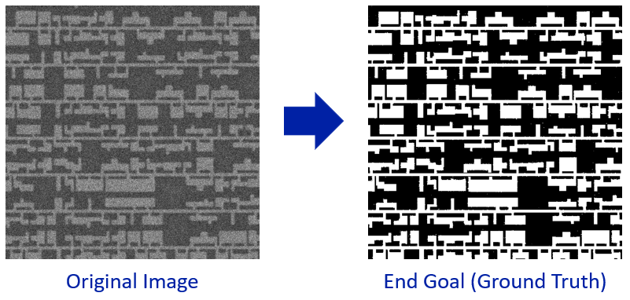

# IC SEM RE Tutorial using AI
In this tutorial, we will be using artificial intelligence (AI) to help reverse-engineer (RE) an integrated circuit (IC) from a scanning electron microscope (SEM) image for hardware assurance. We invite you to follow along with this tutorial and build your own project. We hope this project will serve you well as a resume-booster when applying for a job or further education, or professional development to support your existing position. Using python, this module will introduce various topics within image processing, computer vision, and machine learning. Code in this repository was used for the paper "IC SEM Reverse Engineering Tutorial using Artificial Intelligence", accepted at IEEE Design & Test in 2025. For more information, please refer to our paper at http://dx.doi.org/10.1109/MDAT.2025.3543464.

**TUTORIAL VIDEOS WILL BE LINKED HERE AFTER PUBLICATION, CHECK BACK SOON!** 

## Description
The main goal of this project is to automatically segment the foreground structures of the IC (i.e. the regions of interest) from the background. To accomplish this, we need to take in a grayscale image of an IC and then generate a binary image where the forground pixels are distinctly marked from the background pixels (as shown below). This information can be used to help reverse-engineer the IC.   



This tutorial is divided into four parts:
1. Part 1 sets up our code pipeline for the project
    - Reading and showing images
    - Applying simple thresholding as a naiive segmentation technique
    - Evaluating segmentation results using intersection-over-union (IoU) score
2. Part 2 introduces some topics in Image Processing and Computer Vision
    - Preprocessing using mean filtering 
    - Improving upon simple thresholding using Otsu's method
    - Postprocessing segmentation results using binary opening and closing 
3. Part 3 introduces some topics in Unsupervised Machine Learning
    - Extracting features using blurring, edge detection, and corner detection techniques
    - Segmentation using unsupervised K-means clustering
    - Using cluster centers to understand the k-means clustering algorithm 
4. Part 4 introduces some topics in Supervised Machine Learning
    - Understanding the importance of model generalization incorporating a train/test split 
    - Segmentation using supervised decision tree classification 
    - Segmentation using supervised random forest algorithm to try to achieve better generalization than just one decision tree 

## Installation
Code was tested on Python 3.10.13. To install dependencies in a virtual environment, please download the [requirements-3.10.13.txt](requirements-3.10.13.txt) file and run

```bash
conda create --no-default-packages -n myenv python=3.10.13
conda activate myenv
pip install -r requirements-3.10.13.txt
```
## Technical Overview and Repository Organization
For this study, the sample IC SEM image was taken from a 130 nm smart card. The experiments were conducted on a 32.0 GB Intel(R) Xeon(R) W-1250P CPU with a 64-bit Windows operating system.   

This repository is organized into three main folders: 
1. [code and data/](https://github.com/olivia-dizon-paradis/ic_sem_re_tutorial/tree/main/code%20and%20data) contains the sample image [img_0](https://github.com/olivia-dizon-paradis/ic_sem_re_tutorial/blob/main/code%20and%20data/img_0.png), target ground truth image [gt_0](https://github.com/olivia-dizon-paradis/ic_sem_re_tutorial/blob/main/code%20and%20data/gt_0.png), and .ipynb notebook files
2. [code pdfs/](https://github.com/olivia-dizon-paradis/ic_sem_re_tutorial/tree/main/code%20pdfs) contains .pdf versions of the .ipynb notebook files 
3. [powerpoints/](powerpoints/) contains .pdf versions of the powerpoints introducing the topics for each part 

## Citing
If you use this in your work, please cite the accompanying early access version while the paper is in press:

```bibtex
@article{DizonParadis2025,
  title = {IC SEM Reverse Engineering Tutorial using Artificial Intelligence},
  ISSN = {2168-2364},
  url = {http://dx.doi.org/10.1109/MDAT.2025.3543464},
  DOI = {10.1109/mdat.2025.3543464},
  journal = {IEEE Design &amp; Test},
  publisher = {Institute of Electrical and Electronics Engineers (IEEE)},
  author = {Dizon-Paradis,  Olivia P. and Koblah,  David S. and Wilson,  Ronald and Forte,  Domenic and Woodard,  Damon L.},
  year = {2025},
  pages = {1–1}
}
```
